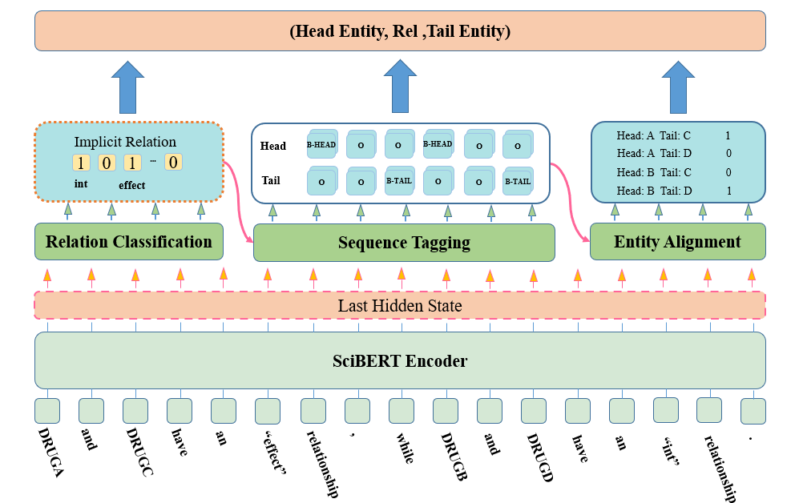

# IREA: A Framework for Drug-drug Interaction Relationship Extraction based on Relationships to Entities

## Overview

 

## Requirements

The main requirements are:

  - python==3.6.9
  - pytorch==1.7.0
  - transformers==3.2.0
  - tqdm

## Dataset


## Usage

**1. Build Data**

Put our preprocessed datasets under `./datasets`.

**2. Train**

Just run the script in `./script` by `sh train.sh`.

For example, to train the model for DDI dataset, update the `train.sh` as:

```
python3 main.py \
--data_dir dataset/DDI_2013 \
--epoch_num=100 \
--max_seq_length=128 \
--bert_model_dir allenai/scibert_scivocab_cased \
--train_batch_size 16 \
--val_batch_size 16 \
--model_dir saved_model/DDI_2013
```

